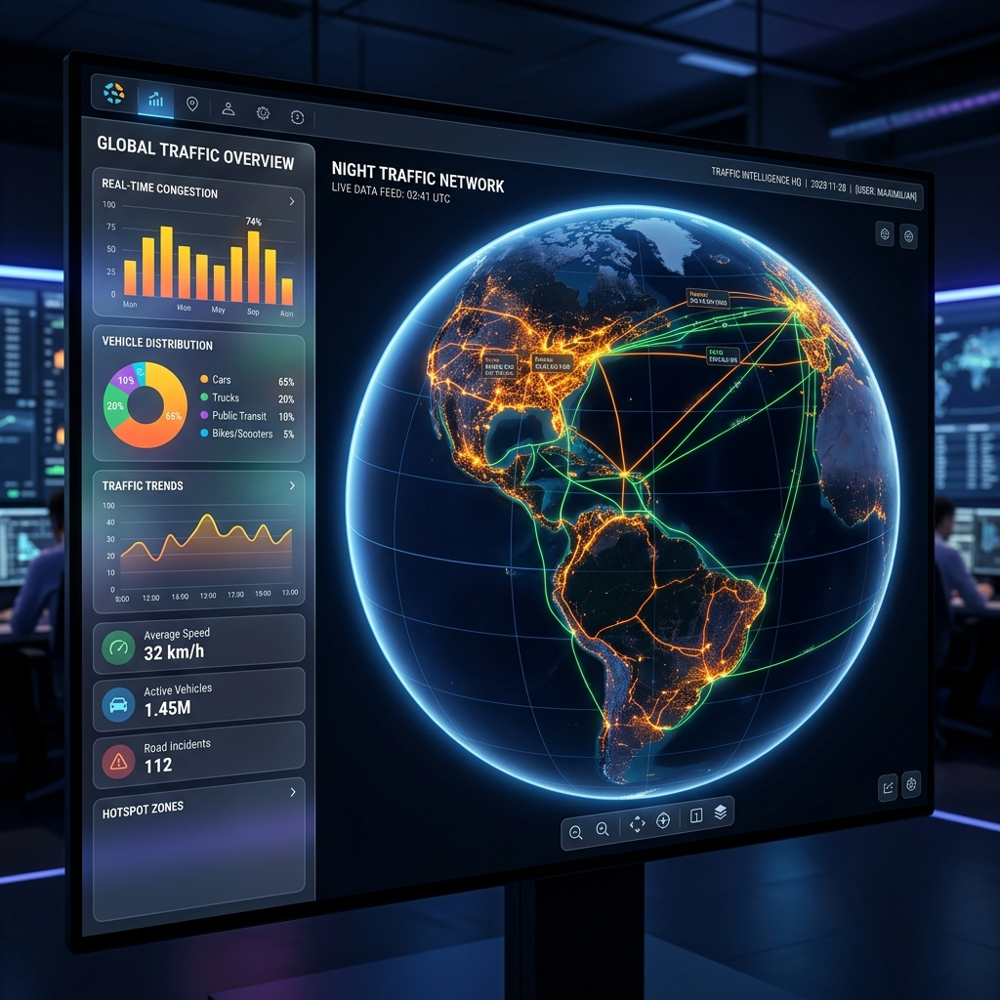

# TrafForesight-AI: 3D Spatio-Temporal Intelligence Dashboard 🚥🌍🚀

**TrafForesight-AI** (formally known as **STRIDE-AI**) is a professional-grade, multi-layered traffic predictive framework designed to optimize urban mobility and emergency response using advanced Machine Learning and cinematic 3D visualization.

---

## 📸 Dashboard Preview

*The interactive dashboard features a 3D Earth Globe with real-time routing intelligence.*

---

## 🎨 Professional Frontend Architecture
The frontend is a bespoke **Glassmorphism-styled Dashboard** built for high-fidelity visualization:
1.  **3D Globe Engine**: Built using the **Google Maps JavaScript Beta API**, enabling full 3D Earth tilt, rotation, and cinematic globe fly-ins.
2.  **Hybrid Search Engine**: Integrated with **Nominatim (OpenStreetMap)** to provide robust, global address search without the limitations of standard API billing.
3.  **Real-Time Analytics**: Seamless integration with **Chart.js** to visualize predicted traffic volumes ($T+1, T+3, T+6$ hours) and multi-step forecasts.
4.  **UX Polish**: Features automatic **Day/Night Theme Detection**, "Fly-to" animations, and professional loading states.

---

## 🏗 System Architecture

*A three-layer intelligence stack synchronizing data, forecasting, and visualization.*

---

## 🧠 Mathematical Foundation

### 1. Feature Engineering: Cyclic Time Encoding
To ensure the AI understands that 11:59 PM is close to 12:01 AM, we implement **Cyclic Trigonometric Encoding** for temporal features:

$$x_{sin} = \sin\left(\frac{2\pi \cdot x}{Max\_x}\right)$$
$$x_{cos} = \cos\left(\frac{2\pi \cdot x}{Max\_x}\right)$$

*Where $x$ is the hour (0-23) or day of the week (0-6).*

### 2. Multi-Objective Route Optimization
The system replaces static Dijkstra with an **AI-Weighted Penalty Function** to calculate the most resilient path:

$$C_{total} = \sum_{i,j \in Path} \left( Time_{base} \cdot P_{congestion} \cdot P_{vehicle} \right)$$
- **$P_{congestion}$**: Dynamic penalty derived from ML volume predictions.
- **$P_{vehicle}$**: Filtering constant (e.g., 2-wheelers receive a $0.98$ bonus in heavy traffic).

### 3. Anomaly Detection
Volume spikes are detected by comparing real-time predictions against a **Dynamic Historical Median ($M_h$ )** derived from uploaded CSV data:

$$Anomaly_{flag} = 1 \text{ if } V_{pred} > (M_h \cdot 1.6)$$

---

## 📊 Evaluation Metrics
The system achieves a significant performance boost over baseline heuristics:

| Metric | Random Forest (Model) | Baseline (Mean) | Improvement |
| :--- | :--- | :--- | :--- |
| **MAE** | **21.55** | 66.63 | **+67.6% Error Reduction** |
| **R² Score** | **0.89** | 0.00 | Excellent Predictive Fit |


---

## 🚀 Key Features
- **Simulation Engine**: "What-if" scenarios for **Peak Load (+30% traffic)**.
- **Multi-Step Forecasting**: $T+1h, T+3h, T+6h$ intelligence.
- **Auto Day/Night**: Automatic theme transition for global visibility.
- **Emergency Optimization**: Tailored routing for priority vehicles.

---

## 🚀 Deployment & Installation

### 1. Local Development
To run the intelligence dashboard on your local machine:
1.  **Install Dependencies**:
    ```bash
    pip install -r requirements.txt
    ```
2.  **Launch the Server**:
    ```bash
    uvicorn app.api:app --reload
    ```
3.  **Access the Dashboard**: Open your browser and navigate to:
    **[http://127.0.0.1:8000/](http://127.0.0.1:8000/)**

### 2. Cloud Deployment (Render.com)
This project is pre-configured for one-click deployment to **Render**:
- **Runtime**: Python 3.10+
- **Build Command**: `pip install -r requirements.txt`
- **Start Command**: `uvicorn app.api:app --host 0.0.0.0 --port $PORT`
- **Config**: Automatically uses the provided `render.yaml` and `Procfile`.

---

## 🕹️ Live Dashboard Guide
1.  **Drop Pins**: Click the "Drop Pins" button to place your **Start (Red)** and **Destination (Green)** markers on the 3D globe.
2.  **Upload Data**: Select a `.csv` file (like the one in `/data`) to establish the traffic baseline.
3.  **Run Intelligence**: Click "Compute AI Best Route" to see the multi-step forecast and optimized path.
4.  **Simulate Stress**: Toggle **Simulation Mode** to see how the AI handles a +30% traffic spike.

---

## 📂 Folder Structure
```text
TrafForesight-AI/
├── app/               # FastAPI Backend & Intelligence Endpoints
├── data/              # Traffic datasets (CSV)
├── model/             # ML Pipeline (Preprocess, Train, Eval)
├── frontend/          # 3D Dashboards (HTML/CSS/JS)
├── assets/            # Architecture diagrams & Model plots
├── tests/             # Unit tests for reliability
└── README.md          # Comprehensive Project Manifesto
```

*Developed for the Spatio-Temporal Route Intelligence (STRIDE-AI) Capstone Project.*
