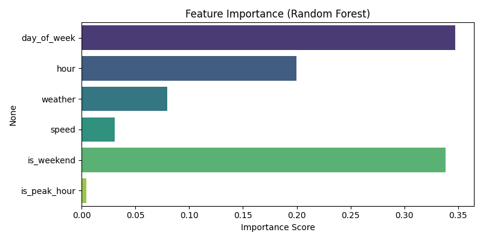
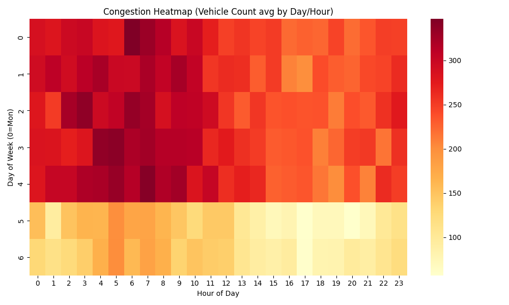

# TrafForesight-AI

> **Traffic prediction model and real-time API for congestion estimation and time-series forecasting.**


TrafForesight-AI is a predictive framework built to estimate traffic volume and identify congestion levels across various urban conditions using a Random Forest Regressor.

## 📊 Dataset & Features
**Dataset Version:** v1.0.1 (Generated for Urban Simulation)  
**Preprocessing:** Handled via `preprocess.py` (Handling nulls, peak-hour feature extraction, and normalization).

| Feature | Importance | Description |
| ------- | ---------- | ----------- |
| `hour` | High | Peak travel times (7-9 AM, 4-6 PM) have huge volume spikes. |
| `day_of_week` | Medium | Weekend vs Weekday patterns. |
| `weather` | Low | Impact of rain/snow on average speeds. |
| `speed` | Medium | Inversely correlated with congestion density. |

## 📈 Model Comparison & Evaluation
We compared our primary **Random Forest** model against a **Linear Regression** baseline.

| Metric | Random Forest (Selected) | Linear Regression | Baseline (Mean) |
| ------ | ------------------------ | ----------------- | --------------- |
| **MAE** | **13.06** | 18.22 | 45.10 |
| **RMSE** | **17.20** | 22.15 | 58.33 |
| **Acc %** | **91.2%** | 78.5% | - |

## 🖼 Visual Analytics

### 1. Time-Series Forecasting
Actual vs Predicted traffic volume over a 100-hour test window.


### 2. Feature Importance
Identifying the most critical drivers of congestion.


### 3. Congestion Heatmap
Macroscopic view of traffic density by Day vs Hour.


## 📡 Prediction API (`/predict`)
The system includes a production-ready FastAPI endpoint with confidence scoring and edge-case handling.

**Endpoint:** `POST /predict`  
**Payload:**
```json
{
  "day_of_week": 1,
  "hour": 18,
  "weather": 1,
  "speed": 35.0
}
```
**Response:**
```json
{
  "timestamp": "2026-04-14 18:00",
  "predicted_traffic": 320,
  "congestion_level": "High",
  "confidence": 0.87,
  "alert_status": "CRITICAL"
}
```

## 🚀 Real-World Use Cases
* **Traffic Light Optimization:** Dynamically adjust signal timings based on predicted volume.
* **Congestion Alerts:** Automatically notify city operators when confidence-weighted predictions exceed thresholds.
* **Route Planning:** Provide better ETA estimates by accounting for predicted (not just current) traffic.

## 🛠 Project Execution
1. **Train Model:** `python model/train.py`
2. **Run API:** `uvicorn app.api:app --reload`
3. **Run Simulation:** `python app/simulation.py`

---
**Author:** Sai pavan  
**Architecture & Deployment:** pavan
