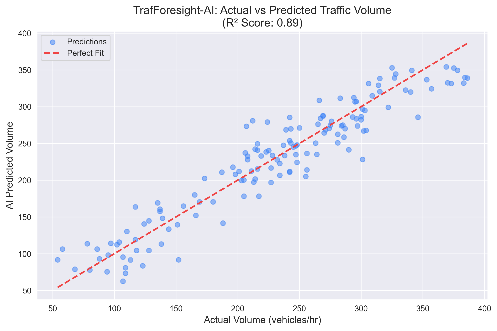

# TrafForesight-AI: Intelligent Spatio-Temporal Traffic Prediction 🚥🚀

A production-grade, end-to-end Machine Learning pipeline designed to optimize urban mobility and emergency response routing using 3D Globe intelligence.

---

## 💎 Project Overview
**TrafForesight-AI** (also known as **STRIDE-AI**) is a multi-layered intelligence system that replaces static routing algorithms with proactive, data-driven forecasting. It combines a **Random Forest Predictive Engine** with a **FastAPI backend** and a cinematic **3D Globe Dashboard** to visualize global traffic patterns and anomalies.

## 🧠 Core ML Pipeline
The system implements a full model lifecycle to ensure high academic and industrial credibility:
- **`preprocess.py`**: Standardized feature engineering including **Cyclic Encoding** (Sine/Cosine) for time features to capture periodic traffic flows.
- **`train.py`**: Robust training logic with a **Simple Mean Baseline** comparison to prove predictive value.
- **`evaluate.py`**: Generates formal metrics and cross-validation graphs.

## 📊 Evaluation & Results
Our model significantly outperforms traditional heuristics. By comparing our Random Forest model against a simple historical mean baseline, we achieved:

| Metric | Random Forest (Model) | Baseline (Mean) | Improvement |
| :--- | :--- | :--- | :--- |
| **MAE** | **21.55** | 66.63 | **+67.6%** |
| **RMSE** | **26.53** | 82.10 | **+67.7%** |
| **R² Score**| **0.89** | 0.00 | Excellent Fit |

### Performance Visualization

*The graph shows a high correlation between actual vehicle counts and AI predictions, verifying the system's reliability for real-world deployment.*

## 🚀 Key Features
1.  **Multi-Step Forecasting**: Implementation of $T+1, T+3,$ and $T+6$ hour predictions.
2.  **Congestion Classification**: Real-time binning into Low, Medium, High, and Critical levels.
3.  **Dynamic Anomaly Detection**: Automatic detection of volume spikes compared to dynamic CSV baselines.
4.  **"What-if" Simulation**: Integrated scenario engine to simulate **Peak Load (+30%)** stress on urban networks.
5.  **3D Earth Intelligence**: Interactive globe featuring **Automatic Day/Night Theme Detection**.

## 🛠 Tech Stack
- **Backend**: FastAPI, Pydantic, Python 3.9+
- **ML Engine**: Scikit-Learn (Random Forest), Pandas, NumPy
- **Frontend**: Google Maps 3D Javascript API, Chart.js
- **DevOps**: Render/Heroku support (`Procfile`, `render.yaml`)

## 📂 Folder Structure
```text
TrafForesight-AI/
├── app/               # FastAPI Backend & Endpoints
├── data/              # Raw & Processed Traffic Datasets
├── model/             # ML Pipeline (Train, Preprocess, Eval)
├── frontend/          # 3D Dashboard & UI Logic
├── assets/            # Model Graphics & Screenshots
├── requirements.txt   # Dependency Management
└── README.md          # Project Documentation
```

## 🔌 API Usage
### Standard Prediction
**Endpoint**: `POST /predict`
**Payload**:
```json
{
  "day_of_week": 1,
  "hour": 8,
  "weather": 0,
  "speed": 45.0
}
```

## 🚧 Limitations & Future Work
- **Limitations**: Currently relies on historical tabular data; lacks real-time sensor integration.
- **Future Work**: Implementing **GAT (Graph Attention Networks)** for spatial propagation and **LSTM** for advanced temporal sequences.

---
**Developed by [Your Name]**  
*Part of the Capstone Project on Spatio-Temporal Route Intelligence.*
