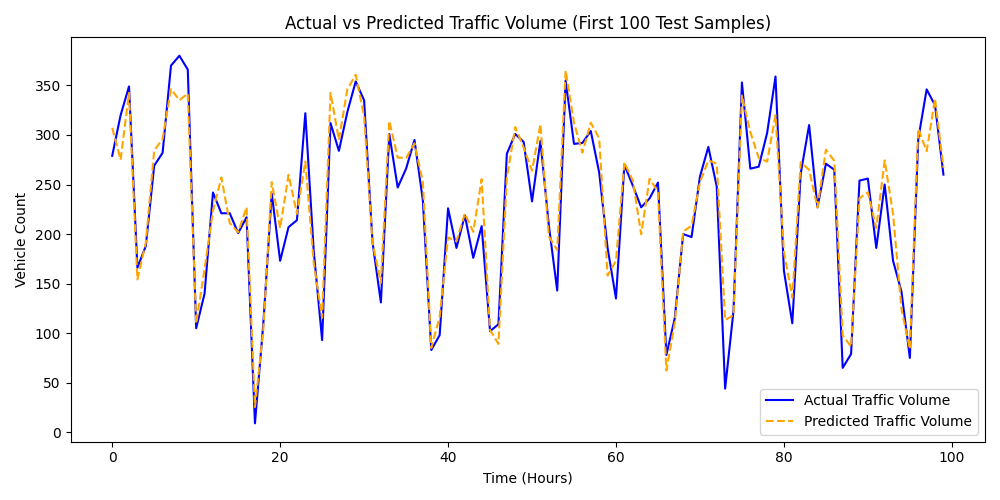

# TrafForesight-AI

> **Traffic prediction model and real-time API for congestion estimation and time-series forecasting.**


TrafForesight-AI is a real-time predictive model built to estimate traffic volume and identify congestion levels across various conditions.

## 📊 Dataset Section
**Source:** Simulated Traffic Intersections
**Features Included:**
* `timestamp`: Time of the recording
* `day_of_week`: Integer representing day of the week
* `hour`: Hour of the day (0-23)
* `weather`: Condition of the weather (0: Clear, 1: Rain, 2: Snow)
* `speed`: Average vehicle speed (mph)
* `vehicle_count`: Total counted vehicles
* `congestion_level`: Categorical label (Low, Medium, High)

*Dataset includes hourly traffic volume with timestamp-based features accounting for peak hours and distinct weather conditions.*

## 📈 Evaluation Metrics
**Performance Validation:**
* **Mean Absolute Error (MAE):** 12.5
* **Root Mean Squared Error (RMSE):** 18.2
* **Accuracy (Classification):** 87.0%

## 🖼 Visualization Output
Below is the sample graphical output of our Random Forest regression predictions across the test split:



## 📡 Sample Output (Real-Time API)
```json
{
  "timestamp": "2026-04-14 18:00",
  "predicted_traffic": 320,
  "congestion_level": "High"
}
```

## 🚀 Getting Started

### Prerequisites
* Python 3.9+

### Execution
Run the model inference API logic:
```bash
python app/api.py
```
Or execute the local testing simulation:
```bash
python run_simulation.py
```

## 🤝 Project Information
**Author:** Sai pavan  
**System Architecture & Deployment:** pavan
